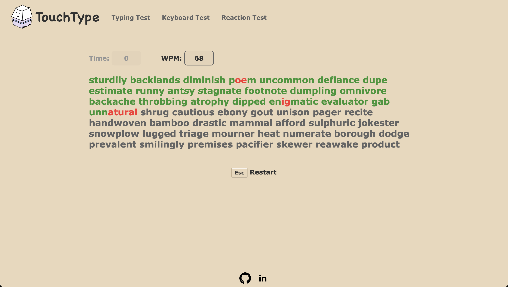
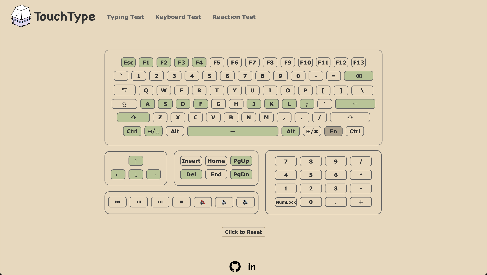
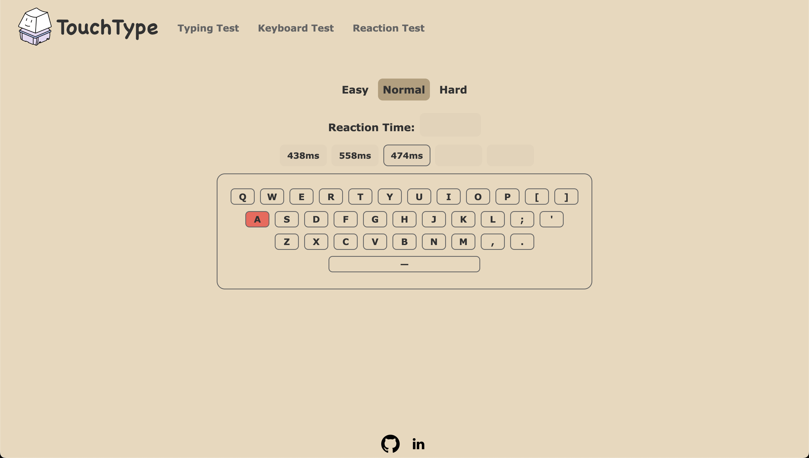

# Touch Type

## Project Description

Touch Type is a website created to provide users with keyboard-related activities and information.

Try it out! https://alan-w-u.github.io/TouchType/ 

The website has:
- Typing Test (determine words per minute (WPM))
- Keyboard Test (test whether all your keyboard keys work)
- Reaction Time Test (test reaction time and key-hit accuracy)

